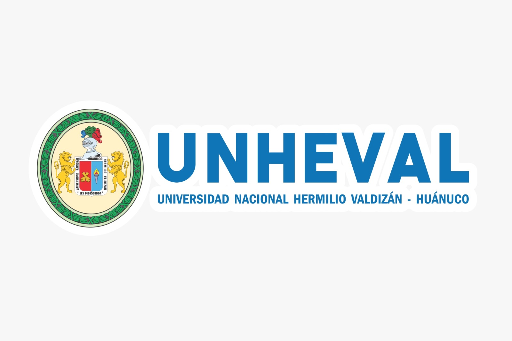

# 📝 INSTRUCCIONES PARA AGREGAR LOGOS INSTITUCIONALES

## 🎯 Logos del Carrusel Actualizado

El carrusel ahora incluye las siguientes empresas:

### ✅ Ya configuradas (con íconos):
1. **Center Trading Corporation** 🌐
2. **Archipier Builder Supply** 🔧 ([https://www.archipierbuildersupply.com/](https://www.archipierbuildersupply.com/))
3. **Girasol** ☀️ ([girasol.pe](http://girasol.pe))

### 📸 Pendientes (espacio preparado para imágenes):
4. **UNHEVAL** - Universidad Nacional Hermilio Valdizán
5. **SENATI** - Servicio Nacional de Adiestramiento en Trabajo Industrial

---

## 📂 PASO 1: Guardar las imágenes

1. Guarda los logos de **UNHEVAL** y **SENATI** en la carpeta:
   ```
   images/
   ```

2. Nombra los archivos:
   - `unheval-logo.png` (o .jpg)
   - `senati-logo.png` (o .jpg)

---

## ✏️ PASO 2: Editar el archivo HTML

Abre el archivo `index.html` y busca las líneas que dicen:

### Para UNHEVAL (línea ~703):
```html
<div class="logo-badge logo-highlighted">
    <div class="logo-placeholder logo-image-space">
        <!-- Espacio para agregar imagen de UNHEVAL -->
        <span class="logo-temp-text">UNHEVAL</span>
        <!-- Descomentar cuando agregues la imagen:
        
        -->
    </div>
</div>
```

**REEMPLÁZALO por:**
```html
<div class="logo-badge logo-highlighted">
    <div class="logo-placeholder logo-image-space">
        
    </div>
</div>
```

### Para SENATI (línea ~711):
```html
<div class="logo-badge logo-highlighted">
    <div class="logo-placeholder logo-image-space">
        <!-- Espacio para agregar imagen de SENATI -->
        <span class="logo-temp-text">SENATI</span>
        <!-- Descomentar cuando agregues la imagen:
        
        -->
    </div>
</div>
```

**REEMPLÁZALO por:**
```html
<div class="logo-badge logo-highlighted">
    <div class="logo-placeholder logo-image-space">
        
    </div>
</div>
```

---

## ⚠️ IMPORTANTE: Hay 2 lugares para cada logo

El carrusel tiene los logos **duplicados** para el efecto continuo. Debes hacer el cambio en **4 lugares totales**:

1. UNHEVAL - Primera aparición (línea ~703)
2. SENATI - Primera aparición (línea ~711)
3. UNHEVAL - Duplicado (línea ~739)
4. SENATI - Duplicado (línea ~747)

---

## 🎨 Características de las imágenes

✅ **Tamaño recomendado:** 200x100px (o proporcional)
✅ **Formato:** PNG con fondo transparente (preferible) o JPG
✅ **Peso:** Menos de 100KB para carga rápida
✅ **Calidad:** Alta resolución para verse bien en pantallas grandes

---

## 🔧 Ajustar tamaño si es necesario

Si las imágenes se ven muy grandes o pequeñas, puedes ajustar el CSS en `styles.css` (línea ~1763):

```css
.logo-image-space img {
    max-width: 100px;  /* Cambia este valor */
    max-height: 60px;  /* Cambia este valor */
    object-fit: contain;
    display: block;
}
```

---

## ✅ Verificación Final

Después de agregar las imágenes:

1. ✅ Abre `index.html` en tu navegador
2. ✅ Ve a la sección "El Equipo" 
3. ✅ Baja hasta "Respaldados por"
4. ✅ Verifica que el carrusel muestre los 5 logos correctamente
5. ✅ Confirma que la animación funcione sin problemas

---

## 🎯 Resultado Esperado

El carrusel mostrará:
1. Center Trading Corporation (con ícono)
2. Archipier Builder Supply (con ícono)
3. Girasol (con ícono)
4. **UNHEVAL (con imagen real)** ⭐
5. **SENATI (con imagen real)** ⭐

¡Todo con animación automática y scroll continuo! 🎉

---

## 💡 ¿Necesitas ayuda?

Si tienes problemas con las imágenes:
- Verifica que los nombres de archivo coincidan exactamente
- Confirma que las imágenes estén en la carpeta `images/`
- Revisa la consola del navegador (F12) para ver errores

